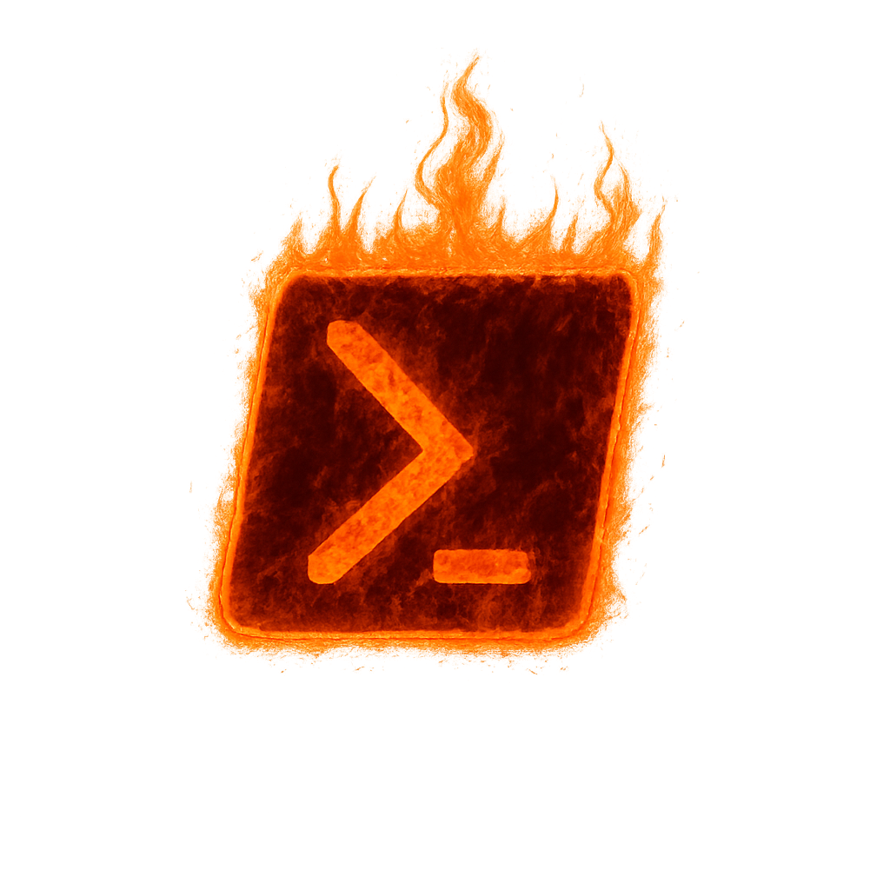

<div align="center">
  
</div>

# PowerHell - Interactive PowerShell Learning Environment

Welcome to PowerHell! Learn PowerShell interactively through simulated job tasks and an engaging terminal interface.

## Modules

The application will be structured into several learning modules:

- **On-Premise**: Active Directory, file servers, local system tasks.
- **MSGraph**: Using the Microsoft Graph PowerShell SDK.
- **Exchange**: Managing Exchange Online / On-Premise.
- **HTTP Client**: `Invoke-WebRequest`, `Invoke-RestMethod`, and direct Graph API calls.
- **Custom & Popular Modules**: Learning modules like EntraExporter.
- **PowerShell SDK Learning**: Building your own custom PowerShell modules using C#.

## Getting Started

1.  **Ensure Go is installed.**
2.  **Navigate to the project directory:**
    ```bash
    cd /home/jake/Programming/main/powerhell
    ```
3.  **Build the application:**
    ```bash
    go build -o powerhell_app .
    ```
4.  **Run the application:**
    ```bash
    ./powerhell_app
    ```
    (On Windows, it might be `powerhell_app.exe` from your WSL environment).

## Directory Structure

The project follows a standard Go project layout:

```
powerhell/
├── go.mod                  // Go module dependencies
├── go.sum                  // Go module checksums
├── main.go                 // Main application entry point & intro screen
├── README.md               // This file: Project overview and instructions
├── pkg/                    // Internal library code, not intended for external use
│   ├── README.md             // Explanation of the pkg directory
│   ├── onprem/               // On-premise learning module
│   ├── mggraph/              // MSGraph PowerShell SDK learning module
│   ├── exchange/             // Exchange PowerShell learning module
│   ├── httpclient/           // HTTP client interaction (Invoke-WebRequest, raw Graph API)
│   ├── custommodules/        // Learning popular/custom PowerShell modules (e.g., EntraExporter)
│   ├── sdklearning/          // PowerShell SDK (C#) module development learning
│   └── ui/                   // UI components (if refactored from main.go or for new views)
└── cmd/                    // (Optional) For multiple executables if needed in future
    └── powerhell_app/        // Main application CLI wrapper (if main.go grows too large)
```

Each module in `pkg/` will have its own `README.md` detailing its purpose and how to contribute to it. The `main.go` currently handles the initial visual intro. Future work will involve integrating module selection into this UI.

## How to Add More Code (General)

- **New Learning Modules**: Create a new directory under `pkg/` (e.g., `pkg/newmodule/`). Add a `newmodule.go` and a `README.md` within it. Implement the module's logic and then integrate its launching mechanism into the main application flow (likely via choices in `main.go` or `pkg/ui/`).
- **Expanding Existing Modules**: Navigate to the specific module directory (e.g., `pkg/onprem/`) and edit its `.go` files to add new lessons, scenarios, or functionalities. Remember to document new features in the module's `README.md`.
